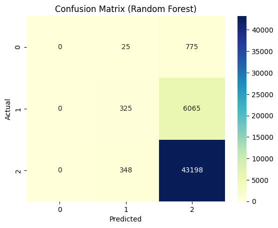
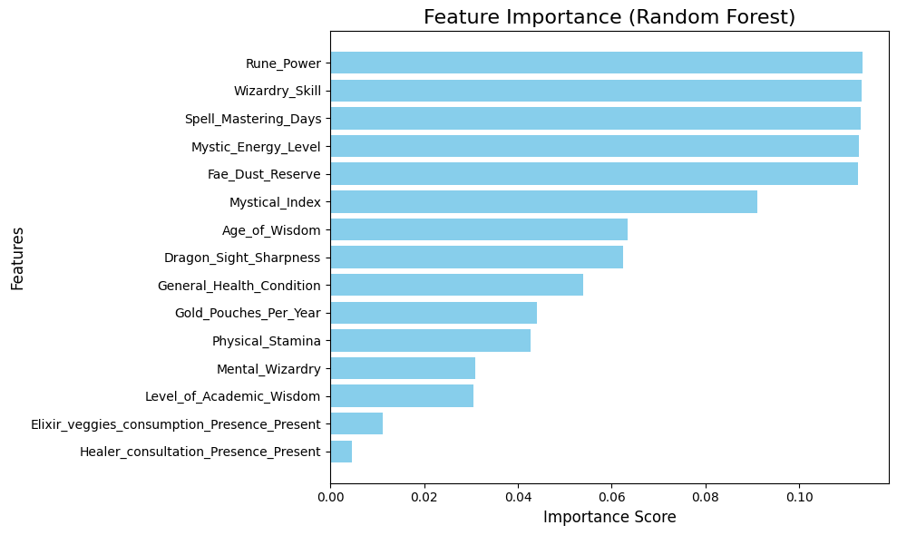

# **Guilds Dataset Analysis and Prediction**

## **Team Members**
- [Your Name]
- [Team Member 2]
- [Team Member 3]

---

## **[Section 1] Introduction**
This project focuses on analyzing the Guilds dataset to predict individuals' guild memberships (`No_Guild`, `Master_Guild`, or `Apprentice_Guild`). Using advanced machine learning techniques, the goal is to build a robust classification model based on features like magical potential, stamina, and experience. The primary objective is to demonstrate how data preprocessing, exploratory data analysis (EDA), and machine learning models can accurately classify guild memberships and identify key features driving the predictions.

---

## **[Section 2] Methods**

### **Proposed Ideas**
1. **Feature Selection:** 
   - Features like `Fae_Dust_Reserve`, `Mystical_Index`, and `Rune_Power` were prioritized due to their strong correlation with the target variable (`Guild_Membership`).
2. **Algorithms:** 
   - Random Forest Classifier
   - AdaBoost Classifier
   - Gradient Boosting Classifier
3. **Design Choices:**
   - **Imputation:** Missing values were handled using the median for numeric features and the most frequent value for categorical features.
   - **Encoding

## **[Section 3] Experimental Design**

### **Purpose**
The primary purpose of this experiment was to predict guild memberships accurately and to evaluate the contribution of various features to model performance.

### **Baseline**
A Random Forest model with default parameters served as the baseline to compare the performance of all other algorithms.

### **Evaluation Metrics**
- **Accuracy:** To measure overall performance.
- **Confusion Matrix:** To evaluate model predictions and misclassifications.
- **F1-Score:** To balance precision and recall for each guild category, especially for underrepresented ones.

---

## **[Section 4] Results**

### **Main Findings**

#### **Accuracy Scores**
- **Random Forest:** 85.78%
- **AdaBoost:** 85.74%
- **Gradient Boosting:** 85.86%

#### **Best Model**
- Gradient Boosting achieved the highest accuracy of **85.86%**, making it the most effective model for predicting guild memberships.

### **Confusion Matrix**
The confusion matrix below illustrates the Random Forest model's performance:

### **Feature Importance**
The top three predictors of guild membership are:
1. `Rune_Power`
2. `Mystical_Index`
3. `Fae_Dust_Reserve`

The plot below shows feature importance as determined by the Random Forest model:

---

## **[Section 5] Conclusions**

### **Takeaway Points**
- **Best Model:** Gradient Boosting was the most effective algorithm, achieving **85.86% accuracy**.
- **Key Predictors:** Features like `Rune_Power`, `Mystical_Index`, and `Fae_Dust_Reserve` play a significant role in predicting guild membership.

### **Limitations and Future Work**

#### **Limitations**
- Class imbalance affected predictions for smaller guild categories (e.g., `Apprentice_Guild`).
- Missing data imputation might introduce bias in the results.

#### **Future Directions**
1. Address class imbalance with oversampling techniques like SMOTE.
2. Explore additional datasets to incorporate more features for better predictions.
3. Investigate deep learning models to leverage feature extraction and non-linear relationships.

---

## **Figures and Artifacts**

### **Figures**
- **Confusion Matrix:** `image/cf.png`
- **Feature Importance:** `image/features.png`

### **Code and Notebooks**
- All analysis and model implementation can be found in `main.ipynb`.
